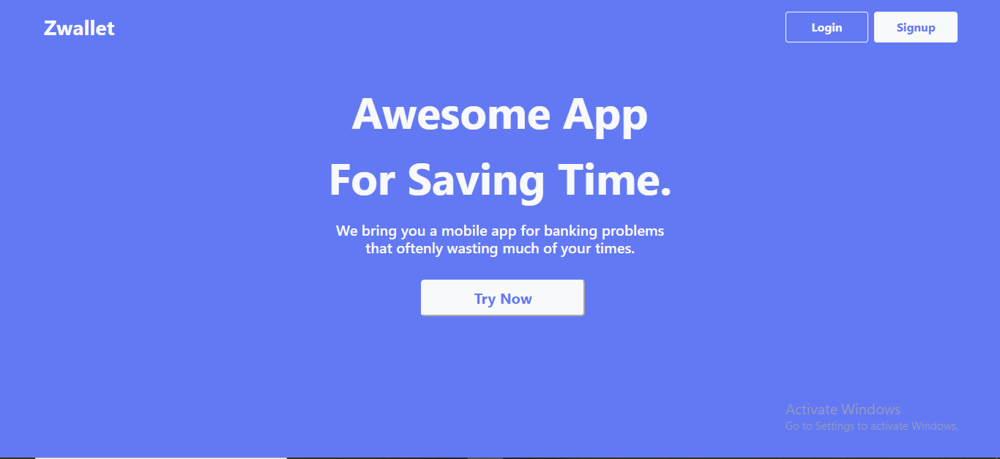
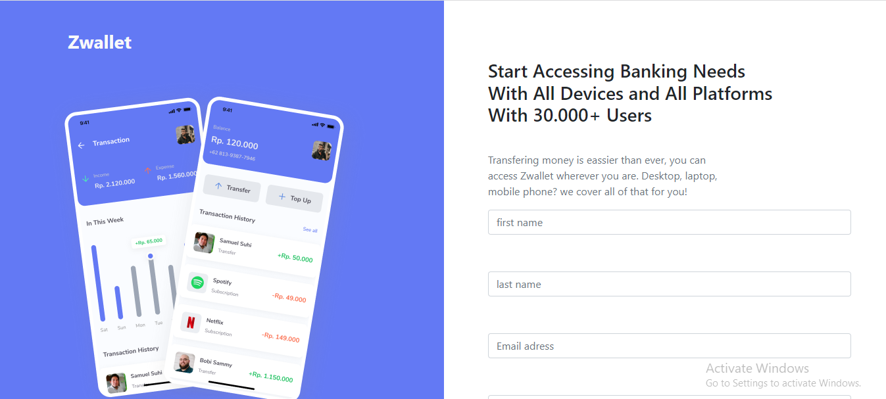

<details>
  <summary>Table Contents</summary>
  <ol>
    <li>
      <a href="#about-the-project">About The Project</a>
      <ul>
        <li><a href="#built-with">Built With</a></li>
      </ul>
    </li>
    <li>
      <a href="#getting-started">Getting Started</a>
      <ul>
        <li><a href="#prerequisites">Prerequisites</a></li>
        <li><a href="#installation">Installation</a></li>
      </ul>
    </li>
    <li><a href="#gallery">Gallery</a></li>
  </ol>
</details>


<!-- ABOUT THE PROJECT -->
## About The Project


Zwallet is a sample Web-based digital wallet using Next.js and for data processing on the frontend using Redux and for the backend use Express.js, Sequelize, and database with MySQL and then I deploy on Heroku.

For the backend repository link [Zwallet-Backend](https://github.com/aliefabdussalam/zwallet-backend)

<p align="right">(<a href="#top">back to top</a>)</p>


### Built With

* [Next.js](https://nextjs.org/)
* [Redux](https://redux.js.org/)
* [Reactstrap](https://reactstrap.github.io/)
* [React-icons](https://react-icons.github.io/)

<p align="right">(<a href="#top">back to top</a>)</p>


<!-- GETTING STARTED -->
## Getting Started

### Prerequisites

* npm
  ```sh
  npm install npm@latest -g
  ```

### Installation

1. Clone the repo backend
   ```sh
   git clone https://github.com/aliefabdussalam/zwallet-backend/
   ```
2. Clone the repo
   ```sh
   git clone https://github.com/aliefabdussalam/zwallet/
   ```
3. Install NPM packages
   ```sh
   npm install
   ```
4. Enter your API in `.env`
  ```
  HOSTNAME="your host"
  PORT="your port"
  NEXT_PUBLIC_API_URL=http://$HOSTNAME:$PORT
   ```

<p align="right">(<a href="#top">back to top</a>)</p>


Below is a sample screenshot of the App Zwallet website display for users.

---------------------------------------------------
Display Web|
:-----------------------:
|
|
|
|
|
|


<p align="right">(<a href="#top">back to top</a>)</p>
